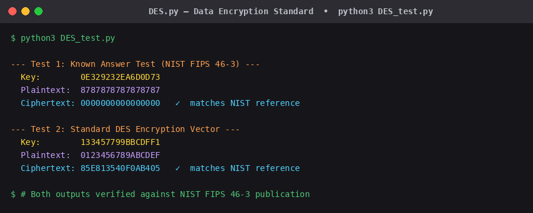

# DES — Data Encryption Standard

A from-scratch Python implementation of the **Data Encryption Standard (DES)** algorithm, written for the **Dell HackTrick** cryptography competition.

The implementation follows the official **NIST FIPS 46-3** publication exactly — all variable names, permutation tables, and S-boxes match the specification directly so the code can be read side-by-side with the standard.

---

## Demo



Both outputs are verified against the NIST FIPS 46-3 known-answer test vectors.

---

## How It Works

DES is a symmetric-key block cipher that encrypts 64-bit blocks using a 56-bit key through 16 rounds of a Feistel network.

```
Plaintext (64-bit)
      │
  Initial Permutation (IP)
      │
  ┌───▼──────────────────────────────┐
  │  16 Feistel Rounds               │
  │  Each round:                     │
  │    • Expand R (32→48 bit)        │
  │    • XOR with round key Kn       │
  │    • Substitute via 8 S-boxes    │
  │    • Permute (P-box)             │
  │    • L(n+1) = R(n)               │
  │    • R(n+1) = L(n) XOR f(R,Kn)  │
  └───────────────────────────────────┘
      │
  Final Permutation (IP⁻¹)
      │
  Ciphertext (64-bit)
```

**Key schedule** generates 16 × 48-bit subkeys from the 56-bit key via PC-1, 16 left-shift rounds, and PC-2 compression.

---

## Usage

```bash
python3 DES_test.py
```

Or import directly:

```python
import DES

KEY = "0E329232EA6D0D73"   # 64-bit hex key
MSG = "8787878787878787"   # 64-bit hex plaintext

ciphertext = DES.main((KEY, MSG))
print(ciphertext)          # → 0000000000000000
```

Both `KEY` and `MSG` are passed as uppercase hex strings. Output is a 16-character uppercase hex string.

---

## Files

| File | Description |
|---|---|
| `DES.py` | Full DES implementation — key schedule, Feistel rounds, all permutation tables |
| `DES_test.py` | Test runner with NIST known-answer vectors |

---

## Requirements

Python 3 — no external libraries needed.

---

## Reference

- [NIST FIPS 46-3](https://csrc.nist.gov/files/pubs/fips/46-3/final/docs/fips46-3.pdf) — the official DES specification used as the sole reference for all permutation tables and equations.
- [DES algorithm walkthrough](https://www.youtube.com/watch?v=AoLbJKh9X2A) — used to understand the algorithm before consulting the spec.
